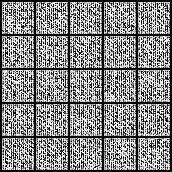
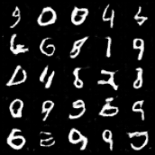
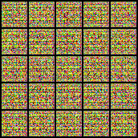
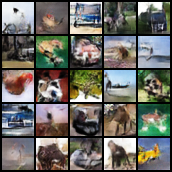
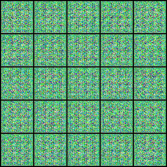
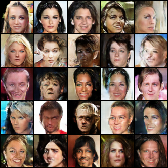

# DCGAN
Pytorch implementation of DCGAN.  


## Requirements  
Code is written in Python 3.7 and Pytorch 1.3.1. 

  
## Run the example  

#### MNIST  
```
python main.py --yaml_path configs/mnist.yaml
```

#### CIFAR10
```
python main.py --yaml_path configs/cifar10.yaml
```
#### With your data path 
``` 
python main.py --yaml_path {yaml} --data_path {path}
```
  
 
## Results

#### MNIST
* Animation  

* Result Image  
  
  
  
  
#### CIFAR10
  
* Animation  

* Result Image  


    
#### CelebA  
* Animation  
  
* Result Image  
